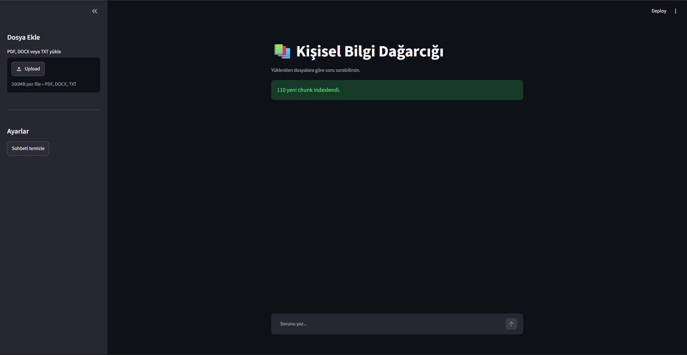

# 📌 RAG Project

A Retrieval-Augmented Generation (RAG) application allows people to upload PDF, DOCX, and TXT documents and use them to ask questions of a local large language model (LLM).

## ✅ Features

- Upload PDF, DOCX, and TXT documents
- Automatic document chunking
- Vector embeddings with ChromaDB
- Semantic similarity search
- Local LLM inference using Ollama
- Context-aware question answering
- Conversation history support

## 🧠 Technologies Used

- Python
- Streamlit
- LangChain
- ChromaDB
- Ollama

## ▶️ Run Locally

Clone the project

```bash
git clone https://github.com/yavuzkrm/rag-project
```

Go to the project directory

```bash
cd rag-project
```

Install dependencies

```bash
pip install -r requirements.txt
```

Install Ollama from:

```bash
https://ollama.com/
```

Download the required model:

```bash
ollama pull llama3.2
```

Start the Ollama server

```bash
ollama serve
```

Run the Streamlit application:

```bash
streamlit run main.py
```


## 📸 Screenshot




