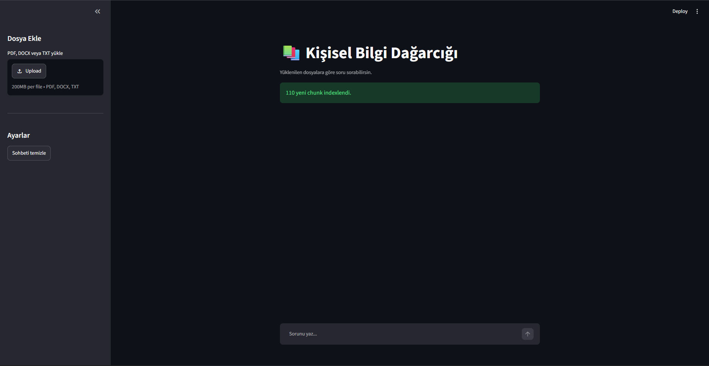
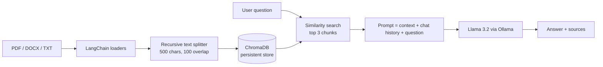

# Personal Knowledge Base — Local RAG Assistant


A **Retrieval-Augmented Generation (RAG)** chat application that lets you upload your own PDF, DOCX and TXT documents and ask questions about them. It answers using a **local LLM**, so no API key is needed and your documents never leave your machine.



## Features

- **Multi-format ingestion**: upload PDF, DOCX and TXT files from the sidebar
- **Incremental indexing**: only new files are chunked and embedded. Files that are already indexed are skipped on later runs.
- **Persistent vector store**: embeddings are stored on disk with ChromaDB and kept between sessions
- **Semantic search**: retrieves the most relevant chunks for each question
- **Local LLM inference**: answers are generated by Llama 3.2 through Ollama
- **Grounded answers**: the model answers from the retrieved context and says when it doesn't know
- **Source attribution**: each answer shows the documents it was based on
- **Conversation memory**: chat history is passed to the model for follow-up questions

## How It Works


```mermaid
flowchart LR
    A[PDF / DOCX / TXT] --> B[LangChain loaders]
    B --> C[Recursive text splitter<br/>500 chars, 100 overlap]
    C --> D[(ChromaDB<br/>persistent store)]
    Q[User question] --> E[Similarity search<br/>top 3 chunks]
    D --> E
    E --> F[Prompt = context + chat history + question]
    F --> G[Llama 3.2 via Ollama]
    G --> H[Answer + sources]
```

1. **Load**: documents in `data/` are read with LangChain document loaders.
2. **Chunk**: text is split into overlapping chunks so that context is kept across chunk boundaries.
3. **Embed & store**: chunks are embedded and saved in a persistent ChromaDB collection.
4. **Retrieve**: the user's question is embedded and the 3 most similar chunks are retrieved.
5. **Generate**: the chunks, the chat history and the question are sent to the local LLM, which writes a grounded answer.

## Tech Stack

| Layer           | Technology                               |
| --------------- | ---------------------------------------- |
| UI              | Streamlit                                |
| Document loading | LangChain (`PyPDFLoader`, `Docx2txtLoader`, `TextLoader`) |
| Chunking        | LangChain `RecursiveCharacterTextSplitter` |
| Vector store    | ChromaDB (persistent client)             |
| LLM             | Llama 3.2 served locally via Ollama      |

## Project Structure

```
rag-project/
├── main.py                     # Streamlit UI: chat, file upload, indexing
├── document_loader_chunker.py  # Loads PDF/DOCX/TXT files and splits them into chunks
├── vektor_store.py             # ChromaDB collection: add, search, list indexed sources
├── llm_client.py               # Builds the prompt and queries the Ollama model
├── config.py                   # Paths for data and the vector database
├── data/                       # Your documents (an example PDF is included)
├── screenshots/
└── requirements.txt
```

## Getting Started

### Prerequisites

- Python 3.10+
- [Ollama](https://ollama.com/) installed

### Installation

```bash
# 1. Clone the repository
git clone https://github.com/yavuzkrm/rag-project
cd rag-project

# 2. (Optional) Create a virtual environment
python -m venv .venv
# Windows: .venv\Scripts\activate   |   macOS/Linux: source .venv/bin/activate

# 3. Install dependencies
pip install -r requirements.txt

# 4. Download the model
ollama pull llama3.2
```

### Run

Make sure Ollama is running (`ollama serve`, or the Ollama desktop app), then run:

```bash
streamlit run main.py
```

The app opens at `http://localhost:8501`. On first launch, all documents in `data/` are indexed automatically. You can add more files from the sidebar.

> **Note:** On first run, ChromaDB downloads its default embedding model (`all-MiniLM-L6-v2`, ~80 MB). The user interface is in Turkish.

## Configuration

| Setting                | Location                     | Default     |
| ---------------------- | ---------------------------- | ----------- |
| Documents folder       | `config.py` → `DATA_PATH`    | `data`      |
| Vector DB folder       | `config.py` → `CHROMA_PATH`  | `chroma_db` |
| LLM model              | `llm_client.py` → `model_name` | `llama3.2` |
| Chunk size / overlap   | `document_loader_chunker.py` | 500 / 100   |
| Retrieved chunks       | `main.py` → `n_results`      | 3           |

To start over with a fresh index, delete the `chroma_db/` folder.

## License

This project is licensed under the [MIT License](LICENSE).
